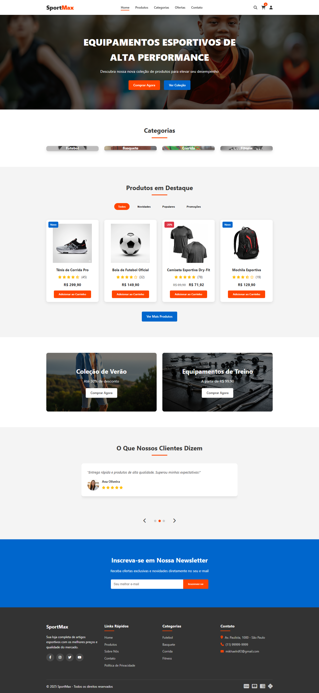
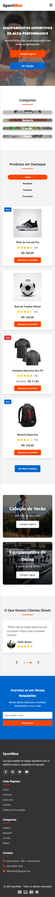

# 🏀 E-commerce Sport-Max

E-commerce Sport-Max é uma loja virtual voltada para a venda de **equipamentos esportivos de alta performance**, como tênis, bolas, camisetas dry-fit, mochilas e mais. O projeto foi desenvolvido com foco em uma interface moderna, intuitiva e responsiva para proporcionar uma excelente experiência ao usuário.

## 📸 Captura de Tela

   
  
   

## 🔧 Tecnologias Utilizadas

- **HTML5** – Estrutura semântica das páginas
- **CSS3** – Estilização moderna e responsiva
- **JavaScript (JS)** – Interativas no front-end

## 🚀 Funcionalidades

- Página inicial com banner de destaque
- Filtro por **categorias esportivas**
- Seção de **produtos em destaque** com preços e avaliações
- Destaques de **promoções** e **novidades**
- Carrossel com depoimentos de clientes
- Formulário de inscrição em **newsletter**
- Rodapé com informações de contato e redes sociais
- Responsividade para dispositivos móveis

## 📬 Contato

- 📧 mikhaelrdf2@gmail.com
- 📱 (27) 99577-1584

